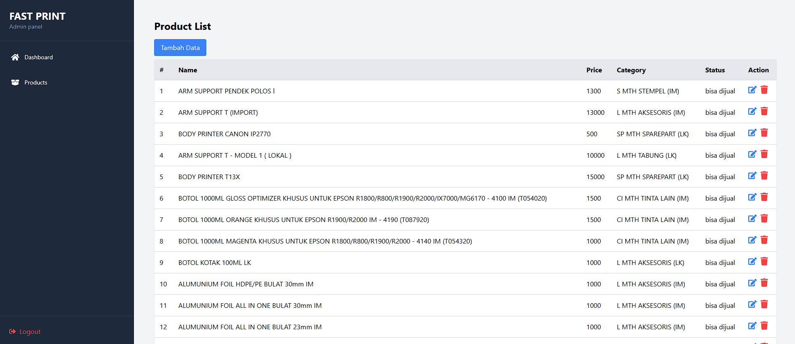

TEST FAST PRINT

Sistem Manajemen Produk dengan Pagination dan CRUD
Proyek ini adalah aplikasi web untuk mengelola daftar produk dengan fitur CRUD (Create, Read, Update, Delete) dan sistem pagination. Setiap halaman menampilkan maksimal 15 produk, dan data produk difilter hanya untuk status yang bisa dijual.

Fitur
Halaman Utama dengan Pagination:

Menampilkan 15 produk per halaman.
Navigasi mudah antar halaman.
Tampilkan data produk yang dapat dijual.

CRUD Produk:

Tambah Produk: Formulir untuk menambahkan produk baru.
Edit Produk: Formulir untuk mengedit produk yang ada.
Hapus Produk: Menghapus produk dengan konfirmasi menggunakan modal.
Modal Konfirmasi:

Memastikan pengguna yakin sebelum menghapus produk.
Desain Responsif:

Tampilan optimal untuk berbagai ukuran perangkat.
Teknologi yang Digunakan
Frontend:

React.js
TailwindCSS
React Icons
React Router DOM
Axios
Backend:

Node.js
Express.js (API untuk produk, kategori, dan status)
Instalasi

1. Clone Repositori
   bash
   Salin kode
   git clone https://github.com/username/product-management.git
   cd product-management
2. Install Dependency
   bash
   Salin kode
   npm install
3. Jalankan Aplikasi
   bash
   Salin kode
   npm start
   Pastikan backend API juga berjalan untuk mendapatkan data produk, kategori, dan status.

Struktur File
graphql
Salin kode
src/
├── components/
│ ├── Product.js # Halaman utama produk
│ ├── Edit.js # Form untuk edit produk
│ └── Create.js # Form untuk menambahkan produk baru
├── services/
│ ├── ProductApi.js # API untuk data produk
│ ├── Category.js # API untuk data kategori
│ └── Status.js # API untuk data status
└── App.js # Titik masuk aplikasi
Cara Penggunaan
Halaman Utama Produk
Produk yang ditampilkan hanya yang memiliki status "bisa dijual".
Gunakan tombol Prev dan Next untuk navigasi antar halaman.
Klik tombol Tambah Data untuk menambah produk baru.
Edit Produk
Klik ikon pensil (✏️) di kolom Action untuk membuka halaman edit.
Formulir akan menampilkan data produk yang sudah ada.
Simpan perubahan dengan klik tombol Save Changes.
Hapus Produk
Klik ikon sampah (🗑️) untuk membuka modal konfirmasi.
Pilih Confirm untuk menghapus produk atau Cancel untuk membatalkan.
Validasi Input
Tambah dan Edit Produk:
Nama Produk: Tidak boleh kosong.
Harga: Harus berupa angka lebih dari 0.
Kategori: Harus memilih salah satu kategori.
Status: Harus memilih salah satu status.
Kontribusi
Fork repositori ini.
Buat branch baru: git checkout -b fitur-baru.
Lakukan perubahan dan commit: git commit -m 'Tambah fitur baru'.
Push ke branch Anda: git push origin fitur-baru.
Ajukan Pull Request.
Lisensi
Proyek ini dilisensikan di bawah MIT License.
