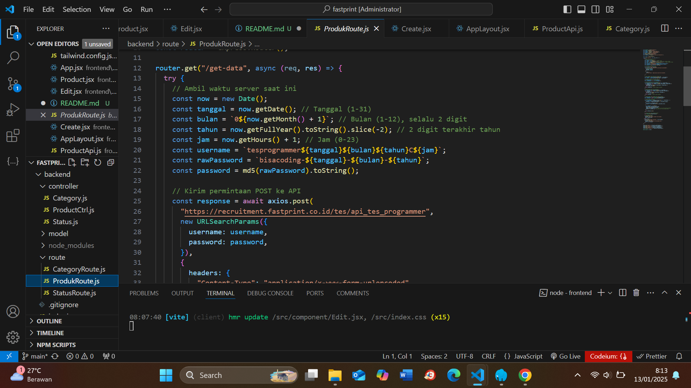
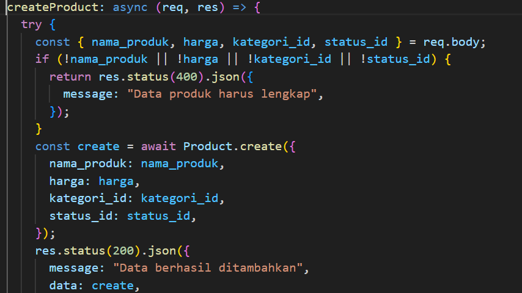
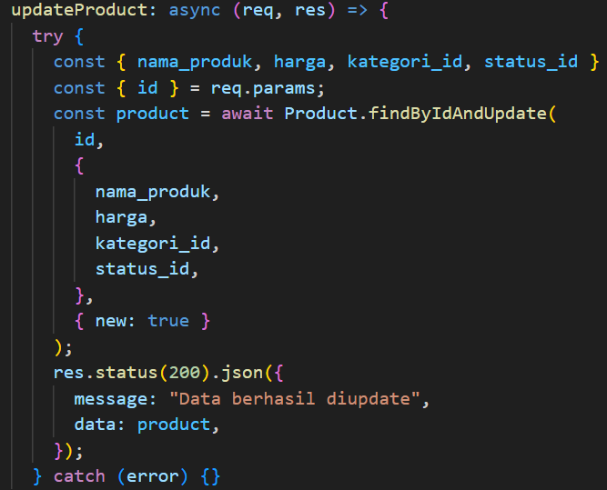
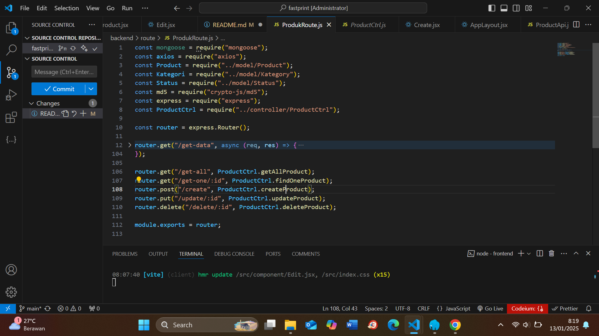
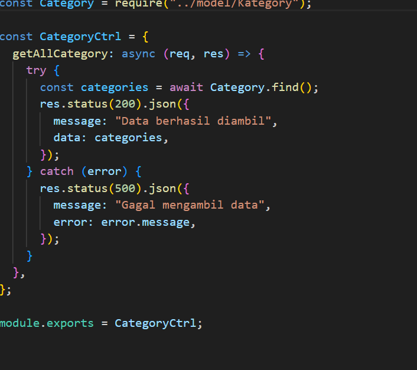
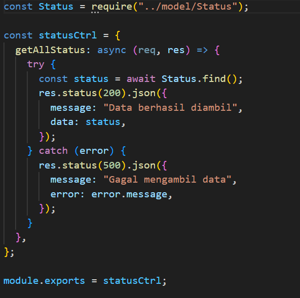

Test Programmer Fast Print

Tech Stack : - React - Express - Node Js - Monggo DB

BackEnd
1.Fetch api https://recruitment.fastprint.co.id/tes/api_tes_programmer menggunakan axios

2 .Simpan data Api Ke Database Menggunakan Monggose
//
const kategori = response.data.data.map((item) => item.kategori);
const status = response.data.data.map((item) => item.status);

    // Mengambil kategori dan status yang unik
    const uniqueStatus = [...new Set(status)];
    const uniqueKategori = [...new Set(kategori)];

    // Simpan kategori yang unik ke database
    const kategoriPromises = uniqueKategori.map(async (kategoriName) => {
      let kategoriDoc = await Kategori.findOne({ nama_kategori: kategoriName });
      if (!kategoriDoc) {
        kategoriDoc = new Kategori({ nama_kategori: kategoriName });
        await kategoriDoc.save();
      }
      return kategoriDoc; // Return kategori document
    });

    // Simpan status yang unik ke database
    const statusPromises = uniqueStatus.map(async (statusName) => {
      let statusDoc = await Status.findOne({ nama_status: statusName });
      if (!statusDoc) {
        statusDoc = new Status({ nama_status: statusName });
        await statusDoc.save();
      }
      return statusDoc; // Return status document
    });

    // Tunggu sampai semua kategori dan status disimpan
    const kategoriDocs = await Promise.all(kategoriPromises);
    const statusDocs = await Promise.all(statusPromises);

    // Simpan produk ke database
    const productPromises = response.data.data.map(async (productData) => {
      const kategoriDoc = kategoriDocs.find(
        (kategori) => kategori.nama_kategori === productData.kategori
      );
      const statusDoc = statusDocs.find(
        (status) => status.nama_status === productData.status
      );

      const newProduct = new Product({
        nama_produk: productData.nama_produk,
        harga: parseInt(productData.harga),
        kategori_id: kategoriDoc._id, // Use the _id of the existing category
        status_id: statusDoc._id, // Use the _id of the existing status
      });

3. Buat Controller Untuk Create ,Update dan Delete Prduct
   //
   
    4. Buatkan Route untuk Masing Masing Controller
   
   5.Buatkan Controller Untuk Category dan Status
   
   

5.Buatkan Server Js Yang Berisi Route dan Port Yang akan DI Consum di FrontEnd

